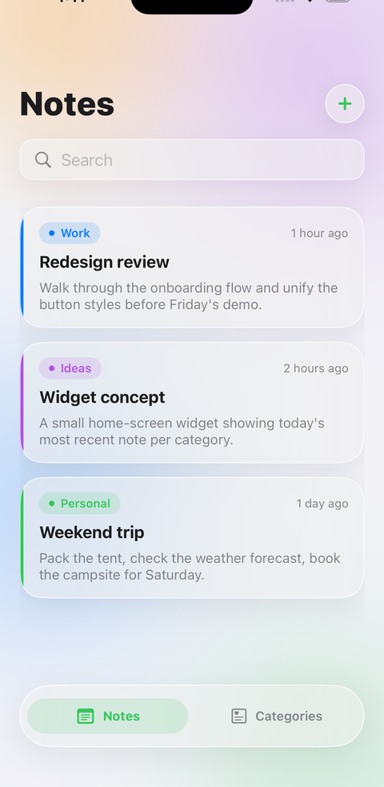
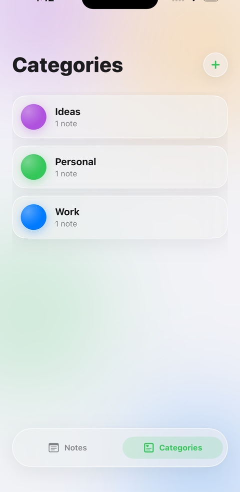

# NotitApp

[](https://github.com/nicovma/NotitApp/actions/workflows/ci.yml)

A note-taking app with color-coded categories, built with SwiftUI, SwiftData, and Swift Concurrency, using a Clean Architecture split (View / ViewModel / UseCase / Repository) behind protocols throughout, with a custom "Liquid Glass" design system.

<p float="left">
  
  
</p>

## Features

- Create, edit, list, and delete notes — each one tagged to a required category, with the category's color shown as a bar on the card.
- Create, edit, and delete categories, each with a name and a color picked from a fixed palette, and drill into a category to see just its notes.
- AI-assisted note suggestions on-device: as you type, Apple Intelligence (FoundationModels) suggests a title and category, shown as editable chips you tap to accept — nothing is applied automatically.
- Custom "Liquid Glass" design system: translucent glass surfaces over a soft blurred backdrop, a real floating tab bar (switching tabs never re-fetches), correct behavior under both Dark Mode and the "Reduce Transparency" accessibility setting.
- Localized in Spanish and English (String Catalog), including a real plural rule for the note count on each category.
- Fully local and offline: no login, no network calls, no setup required beyond opening the project.

## Architecture

```
View ── ViewModel ── UseCase ── Repository ── SwiftData (ModelContext)
```

- **Repository** (`NoteRepository`, `CategoryRepository`) — the only layer that talks to SwiftData. `SwiftDataNoteRepository` and `SwiftDataCategoryRepository` wrap a `ModelContext`; nothing above this layer knows SwiftData exists.
- **UseCase** (`NoteUseCase`, `CategoryUseCase`) — thin business layer between ViewModels and Repositories, kept as a protocol so ViewModels are testable against a mock without touching persistence.
- **ViewModel** — `@MainActor` `ObservableObject`s exposing a `ViewModelState<T>` enum (`idle` / `loading` / `loaded` / `error`) to their View.
- **View** — SwiftUI, no business logic.
- **`DesignSystem`** — the "Liquid Glass" look (blurred backdrop, glass surfaces, shared tab bar) as reusable modifiers/components, kept independent of any screen.
- **`CompositionRoot`** — the single place that wires concrete SwiftData repositories into UseCases into ViewModels. It's the only file in the app that imports SwiftData outside the Repository layer itself, keeping the dependency direction one-way (Views and ViewModels depend on protocols, never on SwiftData directly).

## Tech stack

- Swift 5, SwiftUI, SwiftData, Swift Concurrency (async/await)
- Swift Testing for unit and integration tests

## Setup

No API keys, secrets, or third-party services — the app is entirely local. Open `NotitApp.xcodeproj` and run. Requires Xcode 26+, iOS 26.0+.

See [ARCHITECTURE.md](ARCHITECTURE.md) for the design decisions behind the layers, the AI suggestion flow, and the SwiftData testing setup.

## Testing

```
xcodebuild test -project NotitApp.xcodeproj -scheme NotitApp \
  -destination 'platform=iOS Simulator,name=iPhone 17,OS=latest'
```

Unit tests cover all four ViewModels (success and error paths) against mock UseCases. A separate integration suite exercises both SwiftData repositories against a real, in-memory `ModelContainer` — created fresh per test and kept alive for the test's duration, since a `ModelContext` doesn't retain its own `ModelContainer`.

CI (GitHub Actions) builds and runs the full suite on every push and pull request against `main`/`develop`.

## Git history

Built with a real Git Flow: a `feature/*` branch per unit of work, merged into `develop`.
